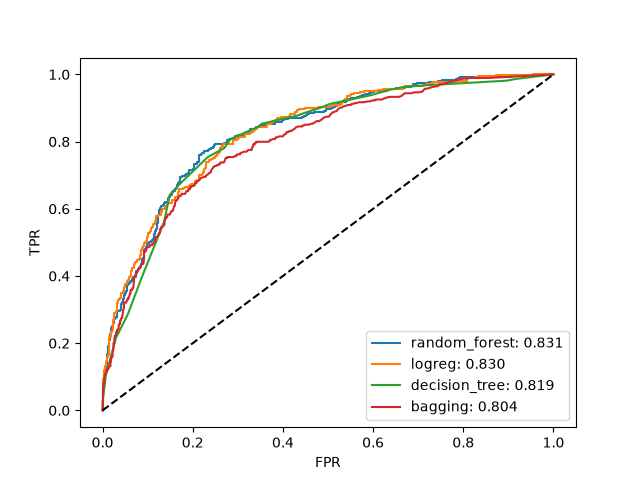

# Churn Prediction Service
Сервис на основе ML-модели для выявления клиентов, которые могут перестать пользоваться услугами в течение месяца.

## Описание задачи
## Данные
## Сравнение алгоритмов
Я сравнил 4 алгоритма (Лог. регрессия, Дерево решений, Случайный лес и Бэггинг) по метрике ROC-AUC

Поиск гиперпараметров моделей реализован при помощи `StratifiedKFold` валидации по метрике ROC-AUC,

# Инструкция по запуску
## Вариант 1. Через Docker Compose (рекомендуется)
## Вариант 2. Локальный запуск

# Структура проекта